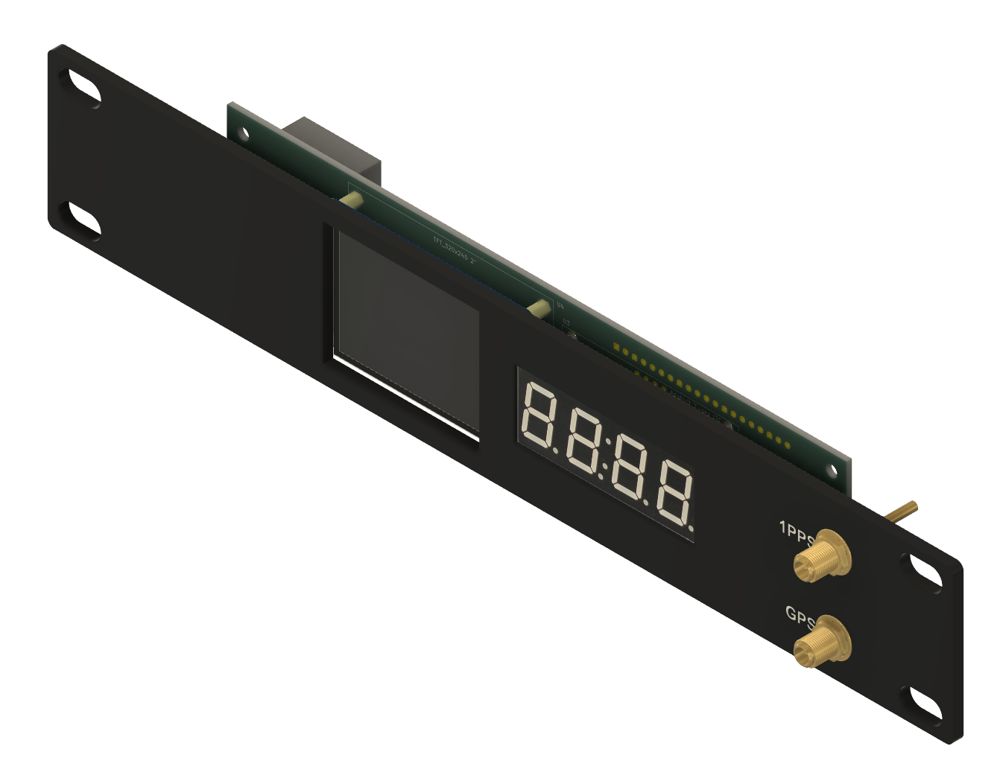

# Pico GPS Clock

This project implements a MicroPython-based GPS clock, displaying live GPS data on both an ST7789V color LCD and a 4-digit 7-segment display (HT16K33). Designed for the Raspberry Pi Pico (or similar), with GPS and display modules.
Thanks to Jeff Geerling for posting a YouTube video https://youtu.be/E5qA4fgdS28?si=43sDkBAGlA567bbp about creating a GPS-Pico clock. From his insiration this extended version was born.
The 3D print files for the case can be downloaded from here. https://makerworld.com/en/models/2351534-10-inch-1u-pico-gps-clock#profileId-2571810

## Features
- Live display of:
	- Date (from GPS)
	- Position (latitude, longitude)
	- Altitude
	- Satellites (used/visible)
	- Time (on 7-segment display)
- ST7789V color LCD for full info
- HT16K33 7-segment display for time
- Modular configuration via `config.py`

## Hardware Requirements
- MicroPython-compatible board (e.g., Raspberry Pi Pico)
- ST7789V SPI color display https://www.amazon.co.uk/dp/B081Q79X2F
- GPS module (UART) https://www.amazon.co.uk/dp/B0FJLXZ3J9
- HT16K33 I2C segment display (for time) https://thepihut.com/products/adafruit-0-56-4-digit-7-segment-display-w-i2c-backpack-white?variant=27739182161

## File Overview
- `main.py`: Main application logic, hardware setup, and main loop
- `config.py`: All hardware pin assignments and global constants
- `st7789py.py`: ST7789V display driver
- `ht16k33.py`, `ht16k33segment.py`: 7-segment display drivers
- `micropyGPS.py`: GPS parsing library

## Usage
1. Edit `config.py` to match your hardware pinout and display settings.
2. Flash all files to your MicroPython device.
3. Connect the required hardware (GPS, LCD, 7-segment display).
4. Run `main.py`.

## Notes
- The LCD shows date, position, altitude, and satellite info live from GPS.
- The 7-segment display shows the current time.

## License
MIT License. See source files for details.

---

GitHub: [https://github.com/dancingbear1965/Pico_GPS_Clock](https://github.com/dancingbear1965/Pico_GPS_Clock)
